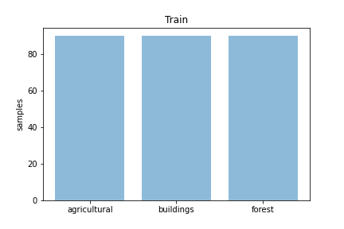
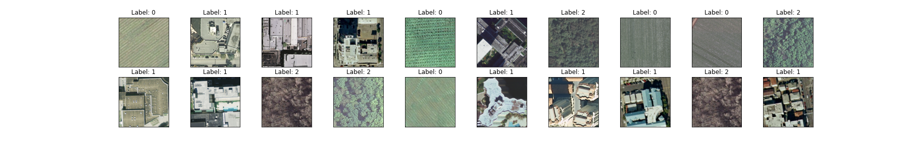

# Classification Remote Sensing UCMerced

By [Luiz H. Buris](http://)


## Introdução


## Citation

If you use this method or this code in your paper, then please cite it:

```
@article{XXXXXXXXXX,
  title={XXX},
  author={Luiz H Buris},
  journal={arXiv preprint arXiv:XXXX.XXXXX},
  year={20XX},
  url={https:https://arxiv.org/pdf/XXXX.XXXXX.pdf},
}
```

##  CNN on training

<p align="center">
</img>
</p>

<p align="center">
</img>
</p>


## Code organization

- `train.py`: .........


## Train
you can now carry out "run" the python scrypt with the following command:

```sh


```

## Resultado

## Confusion Matrix 

<p align="center">
</img>
</p>


## Graphic Train, Loss, test classification


<p align="center">
</img>
</p>

<p align="center">
</img>
</p>
